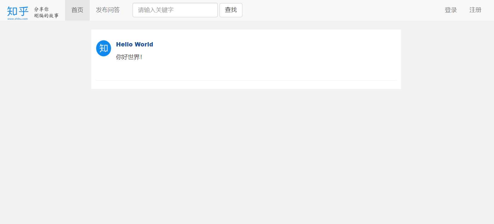

<h1 align="center"><a href="https://github.com/tyrr-hz/zhihu">知乎问答平台</a></h1>

> 知乎问答平台是一款现代化的社交平台，供广大知友交流发帖。

# 简介

**知乎问答平台**，一个优秀的开源社交平台，由Tyrr主导开发，具有良好的社交氛围。

# 快速开始

## 下载[GitHub源码](https://github.com/tyrr-hz/zhihu.git)

使用IDEA或者Eclipse工具打开，在application.yaml中更改本地数据源，示例如下：

```
spring:
  datasource:
    url: jdbc:mysql://localhost:3306/zhihu?serverTimezone=Asia/Shanghai
    username: root
    password: 123456
    driver-class-name: com.mysql.cj.jdbc.Driver
```

其中url中的`zhihu`修改为自己创建的数据库，分别设置连接名username和密码password，运行

## 平台示例如下：

